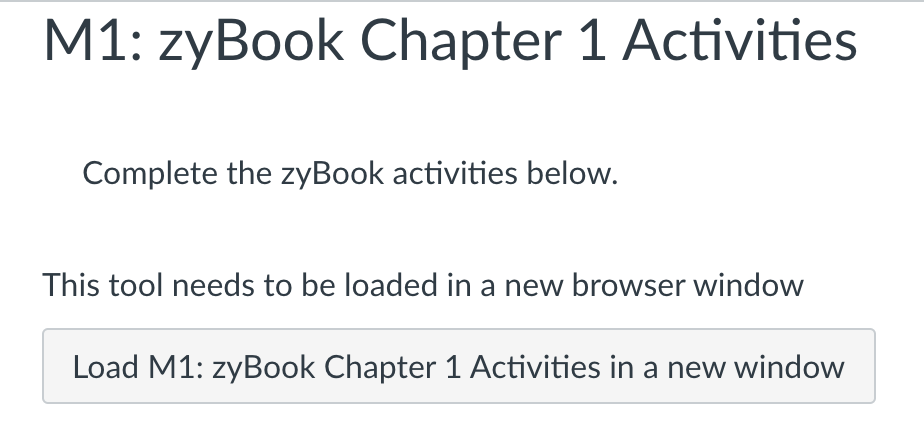

# Getting Started With zyBooks

This course uses a custom zyBook from the *zyBooks* Wiley Brand as a required
course resource. Payment for zyBook access is handled via the AU All Access
program, and there is a Canvas announcement with details about that.

To access and subscribe to the zyBook:

1. Go to the first zyBook assignment in Canvas, which is the very next section
   in this module.
1. Click on the "load in a new window" button at the bottom of the page, as
   pictured below.
   
   *This will open the course zyBook.*
1. Provide the AU All Access access code (received via email from
   `noreply@auburn.edu`) to subscribe to the zyBook.

Here are links to Help Center articles provided by zyBooks that provide an
overview of assignments in zyBooks and how to submit them for grades in Canvas.

- [What are assignments, how do I get credit for them and how do I submit them?](https://zybooks.zendesk.com/hc/en-us/articles/360007538033-What-are-assignments-how-do-I-get-credit-for-them-and-how-do-I-submit-them-)

- [How do I get points for an assignment?](https://zybooks.zendesk.com/hc/en-us/articles/360013555714-How-do-I-get-points-for-an-assignment)

- [How to submit assignments to Canvas](https://zybooks.zendesk.com/hc/en-us/articles/360019977494-How-to-submit-assignments-to-Canvas)

