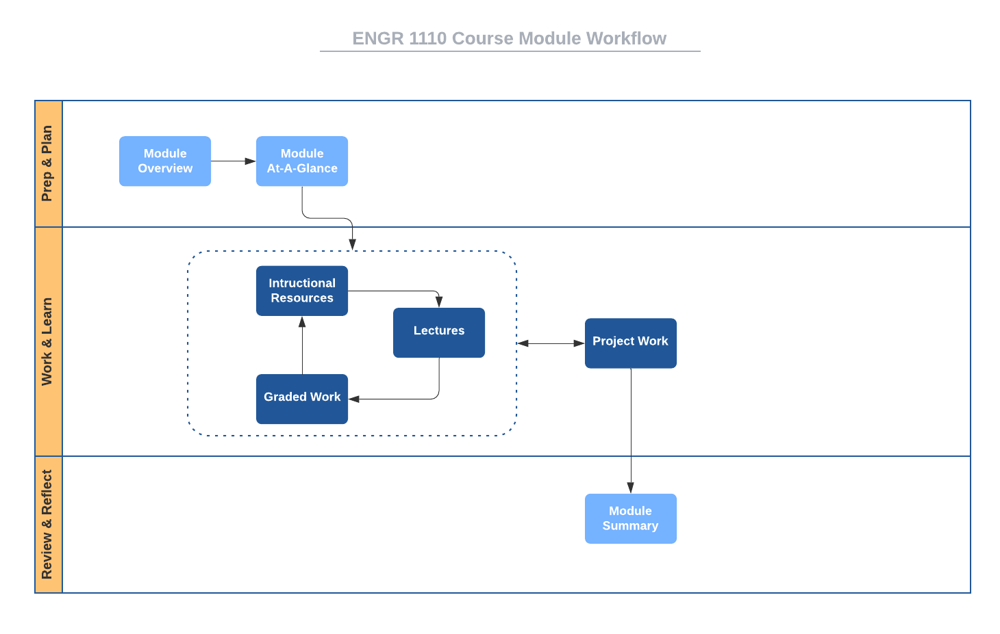

# Course Structure

This course is organized into eight modules numbered
[zero](https://www.cs.utexas.edu/users/EWD/transcriptions/EWD08xx/EWD831.html)
through seven. Module 0 is an introductory "getting started" module, while
Module 1 through Module 7 are course-content modules. Rather than being
organized strictly by content, these modules are
[timeboxed](https://en.wikipedia.org/wiki/Timeboxing); that is, M1 -- M7 are of
fixed, equal durations with specific tasks to be completed within each. We will
become familiar with [agile
methods](https://en.wikipedia.org/wiki/Agile_software_development), as we go
through the course and you'll recognize similarities to
[Scrum](https://en.wikipedia.org/wiki/Scrum_(software_development)) sprints.

Scheduling, planning, and knowing when things are due are easy with timeboxed
modules. All graded items are scheduled to be due or delivered on module
boundaries. Specifically, each graded item in the course is due by the last
Friday of the module that contains it. The last Saturday and Sunday of each
module are late days: assignments due during the module can be turned in for
significant grade penalties.

Here is the specific schedule for [Spring 
2022](http://www.auburn.edu/main/auweb_calendar.php).

Module | Begin | End
------ | ----- | ---
M0 | Wed 12 Jan | Sun 16 Jan  
M1 | Mon 17 Jan | Sun 30 Jan  
M2 | Mon 31 Jan | Sun 13 Feb  
M3 | Mon 14 Feb | Sun 27 Feb  
M4 | Mon 28 Feb | Sun 20 Mar  
M5 | Mon 21 Mar | Sun 3 Apr  
M6 | Mon 4 Apr  | Sun 17 Apr  
M7 | Mon 18 Apr | Fri 29 Apr  

# Module Structure

Each of the seven content modules has the same structure with the following
components.

- **Module Overview:** A brief introduction to the module content.
- **Module At-A-Glance:** A more complete description of the module focus, tips
  for success, and learning objectives.
- **Instructional Resources:** Links to lecture notes for the module and
  references to associated readings from textbooks.
- **Graded Work:** Deliverables from the Activities, Labs, Project, and Reading,
  Response, & Reflection categories that must be turned in for a grade.
- **Summary:** A brief recap of what was covered in the module.

# Workflow

Since each content module has the same structure, you can apply the same process
to going through each. Here is a suggested
[workflow](https://en.wikipedia.org/wiki/Workflow) for going through each module
of this course.

Notice the iterative nature of the items in the *Work & Learn*
[swimlane](https://en.wikipedia.org/wiki/Swim_lane). Start each module when it
opens rather than putting things off, as it will likely take you the full two
weeks to complete all the work.

