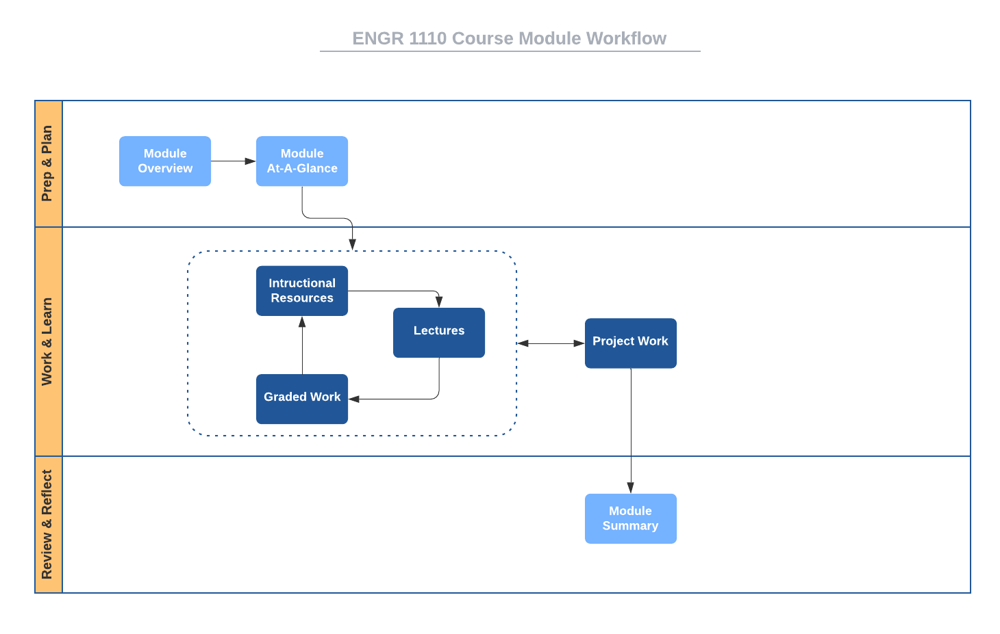

# Course Structure

This course is organized into eight modules numbered
[zero](https://www.cs.utexas.edu/users/EWD/transcriptions/EWD08xx/EWD831.html)
through seven. Module 0 is an introductory "getting started" module, while
Module 1 through Module 7 are course-content modules. Rather than being
organized strictly by content, these modules are
[timeboxed](https://en.wikipedia.org/wiki/Timeboxing); that is, M1 -- M7 are of
fixed, equal durations with specific tasks to be completed within each. We will
become familiar with [agile
methods](https://en.wikipedia.org/wiki/Agile_software_development), as we go
through the course and you'll recognize similarities to
[Scrum](https://en.wikipedia.org/wiki/Scrum_(software_development)) sprints.

Scheduling, planning, and knowing when things are due are easily done with
timeboxed modules. All graded items are scheduled to be due or delivered on
module boundaries. Specifically, each graded item in the course is due by the
last day of the module that contains it or of a later module as specified by
its due date. 

Here is the schedule for [the current semester](http://www.auburn.edu/main/auweb_calendar.php).

Module    | Dates                   | Duration 
------    | ----------------------- | -------- 
Module 00 | Wed 10 Jan - Sun 14 Jan | (5 days)
Module 01 | Mon 15 Jan - Sun 21 Jan | (7 days)^  
Module 02 | Mon 22 Jan - Sun 28 Jan | (7 days)   
Module 03 | Mon 29 Jan - Sun 04 Feb | (7 days)  
Module 04 | Mon 05 Feb - Sun 11 Feb | (7 days)  
Module 05 | Mon 12 Feb - Sun 18 Feb | (7 days)  
Module 06 | Mon 19 Feb - Sun 25 Feb | (7 days)  
Module 07 | Mon 26 Feb - Sun 03 Mar | (7 days)  
Module 08 | Mon 11 Mar - Sun 17 Mar | (7 days)^  
Module 09 | Mon 18 Mar - Sun 24 Mar | (7 days)  
Module 10 | Mon 25 Mar - Sun 31 Mar | (7 days)  
Module 11 | Mon 01 Apr - Sun 07 Apr | (7 days)  
Module 12 | Mon 08 Apr - Sun 14 Apr | (7 days)  
Module 13 | Mon 15 Apr - Sun 21 Apr | (7 days)  
Module 14 | Mon 22 Apr - Fri 26 Apr | (5 days)  

^ *University No-Class Days:*  
Mon 15 Jan, MLK Day
Sat 02 Mar - Sun 10 Mar, Spring Break

# Module Structure

Each of the seven content modules has the same structure with the following
components.

- **Module Overview:** A brief introduction to the module content.
- **Module At-A-Glance:** A more complete description of the module focus, tips
  for success, and learning objectives.
- **Instructional Resources:** Links to lecture notes for the module and
  references to associated readings from textbooks.
- **Graded Work:** Deliverables from the Activities, Labs, Project, and Reading,
  Response, & Reflection categories that must be turned in for a grade.
- **Summary:** A brief recap of what was covered in the module.

# Workflow

Since each content module has the same structure, you can apply the same process
to going through each. Here is a suggested
[workflow](https://en.wikipedia.org/wiki/Workflow) for going through each module
of this course.

Notice the iterative nature of the items in the *Work & Learn*
[swimlane](https://en.wikipedia.org/wiki/Swim_lane). Start each module when it
opens rather than putting things off, as it will likely take you the full two
weeks to complete all the work.

