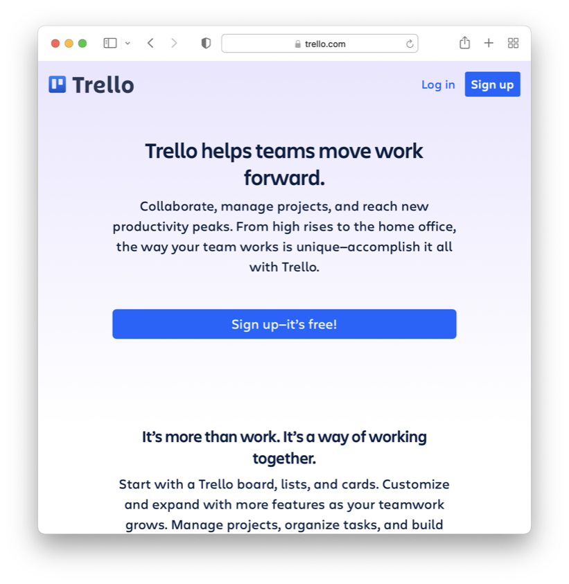
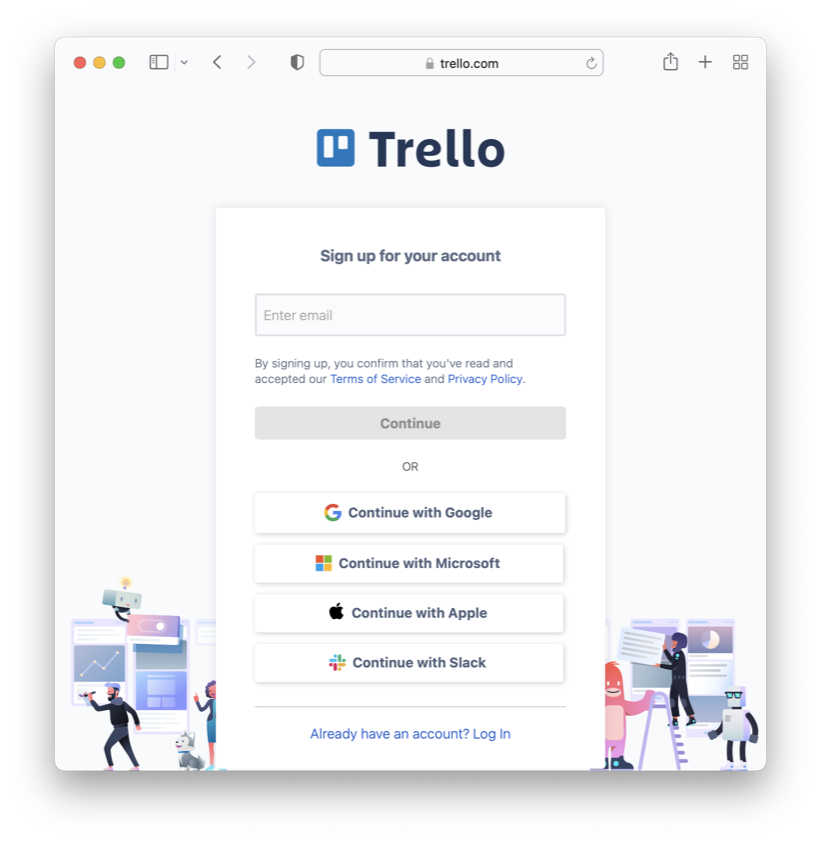
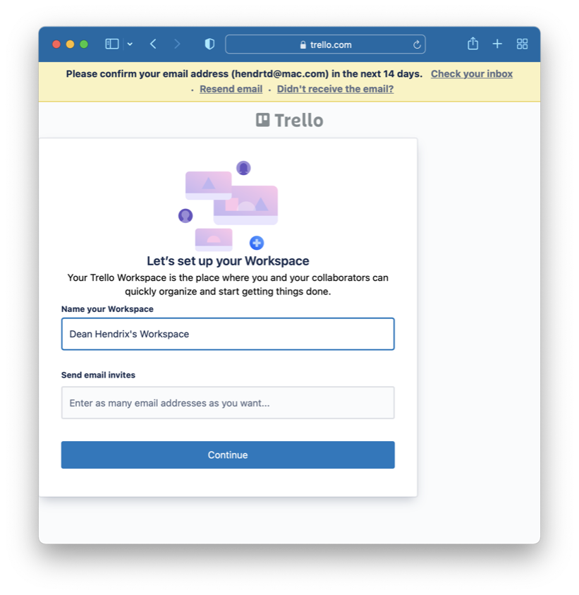
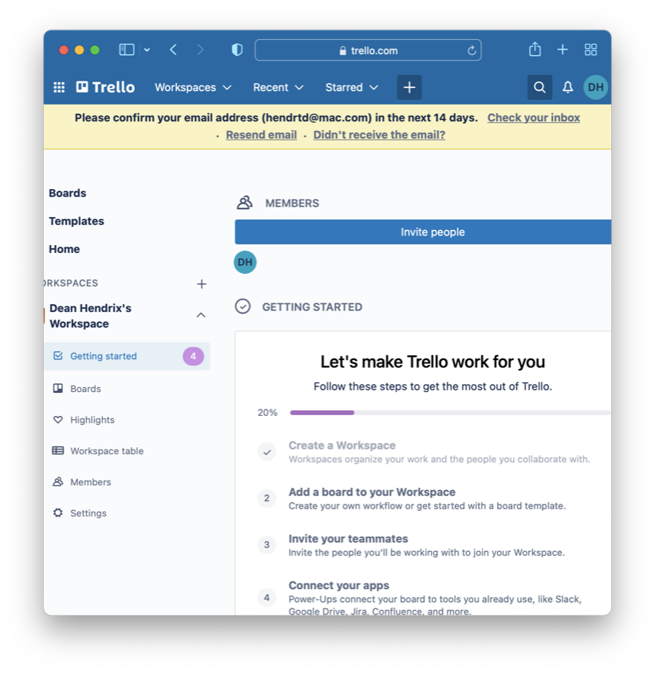

# Getting Started with Trello

Trello is a web-based tool that supports work management via
[Kanban](https://en.wikipedia.org/wiki/Kanban_board) boards. Trello is owned by
[Atlassian](https://www.atlassian.com/), a company that develops products for
software development and project management. You and your team will use Trello
to manage the work required for the team project in this course.

This activity is designed to introduce you to Trello and to get you started
using it to plan, organize, and document your work.

1. Load [Trello](http://trello.com) in a web browser. 

1. Enter your email address and sign up.  

1. Name your workspace 

1. Click *Skip* to avoid signing up for Premium or the free trial. **The free
   version is all you need.**

1. From the main workspace screen you can explore the template gallery to get an
   idea of the kinds of boards you can build. 
   

1. Use the Workspace Settings menu to make your workspace **Public**.

1. Build a sample board and explore the different options you have for organizing
   and planning your work.

Be sure to spend some time familiarizing yourself with Trello, and discuss with
your team how Trello can be used once you begin your project work.

