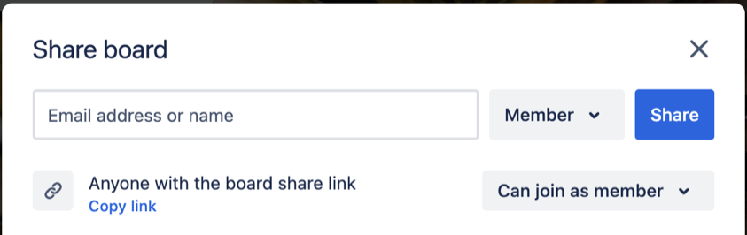

# Using Trello to Manage Individual Work

This assignment requires you to use Trello to plan, organize, and document your
work.

1. Load [Trello](http://trello.com) in a web browser and log in to your account. 

1. Click on the plus symbol (+) at the top of the screen to create a new board.
   Name the new board "Module 6 zyBook Labs".

1. Create three lists: Backlog, In Progress, and Done. 

1. Add a card for each Chapter 8 lab to the Backlog list.
    - 8.5 LAB: Checker for integer string
    - 8.6 LAB: Name format
    - 8.7 LAB: Count characters
    - 8.8 LAB: Mad Lib - loops
    - 8.9 LAB: Remove all non-alpha characters 

1. Add due dates, checklists, and other features to the card for each lab to
   help plan and schedule your work. At a minimum, you must add the following due dates: 
    - 8.5 due on Mon 19 Feb 
    - 8.6 due on Tue 20 Feb 
    - 8.7 due on Wed 21 Feb 
    - 8.8 due on Thu 22 Feb
    - 8.9 due on Fri 23 Feb 

1. Move each card to "In Progress" as you begin working on that lab, and then
   move the card to "Done" once you've earned full points.

1. Continue to use the board to document your progress toward the completion of
   the assignment.

1. Once you have completed the assignment and documented your work in the Trello
   board, click the Share button in the top-right of the Trello interface and
   select "Copy link".  

1. Record this link as the required submission to this assignment.

