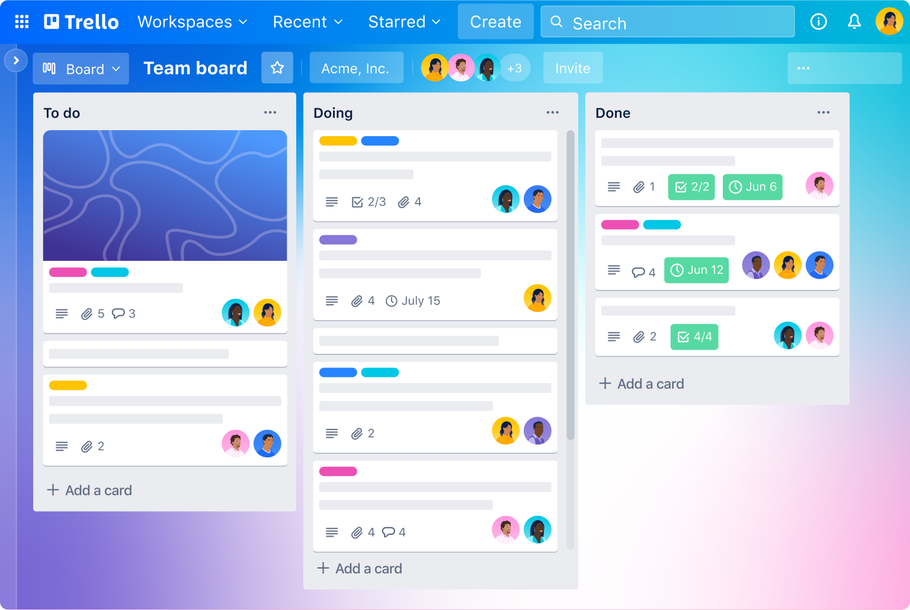

# Using Trello to Manage and Document Work

Trello is a web-based tool that supports work management via
[Kanban](https://en.wikipedia.org/wiki/Kanban_board) boards. Be sure to spend
some time familiarizing yourself with Trello, and discuss with your team how
Trello can be used once you begin your project work.

