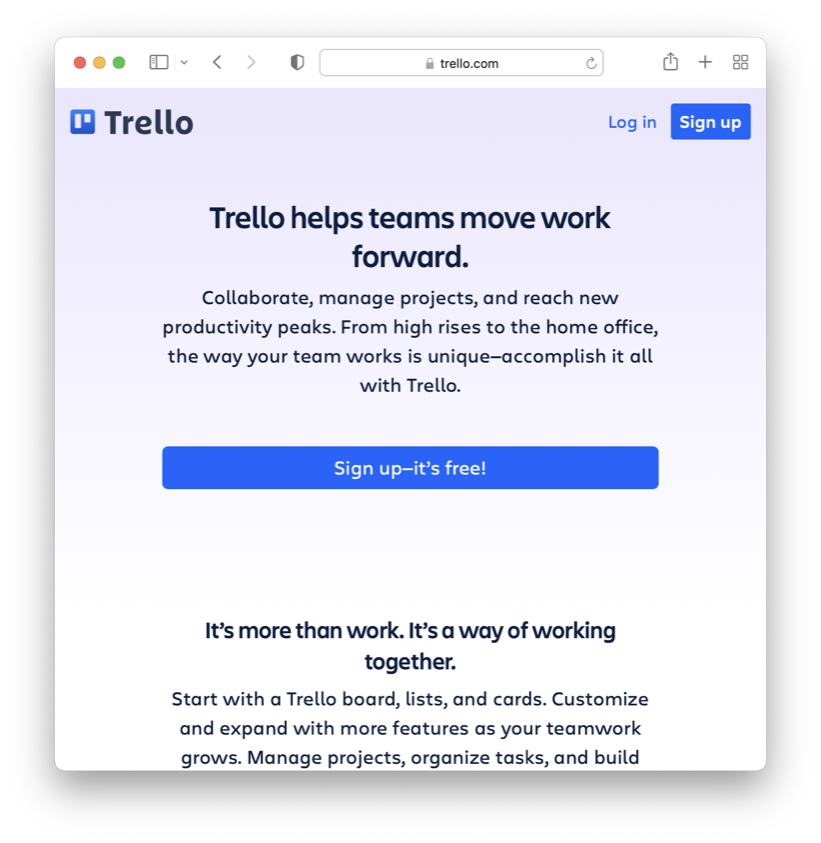
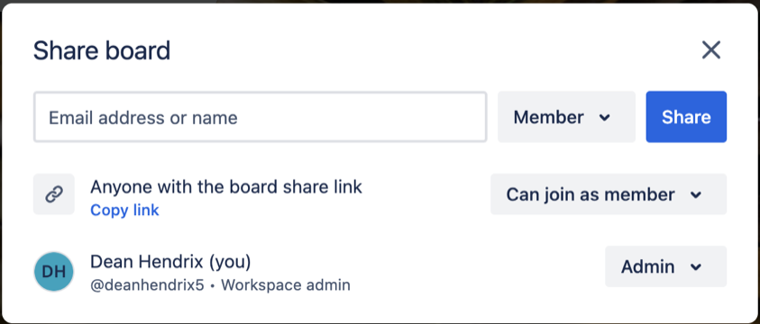

# Getting Started with Trello

Trello is a web-based tool that supports work management via
[Kanban](https://en.wikipedia.org/wiki/Kanban_board) boards. Trello is owned by
[Atlassian](https://www.atlassian.com/), a company that develops products for
software development and project management. You and your team will use Trello
to manage the work required for the team project in this course.

This activity is designed to introduce you to Trello and to get you started
using it in a Team Lab Assignment.

1. Load [Trello](http://trello.com) in a web browser. 

1. Enter your email address and sign up.  

1. Name your workspace 

1. Click *Skip* to avoid signing up for Premium or the free trial. **The free
   version is all you need.**

1. From the main workspace screen you can explore the template gallery to get an
   idea of the kinds of boards you can build. 
   

1. Use the Workspace Settings menu to make your workspace **Public**.

1. Build a sample board and explore the different options you have for organzing
   and planning your work.

1. Click on the plus symbol (+) at the top of the screen to create a new board.
   Name the new board "zyBook Chapter 9 Labs".

1. Create three lists: Backlog, In Progress, and Done. Add a card for each
   Chapter 9 lab in the assignment to the Backlog list.

1. Add due dates, checklists, and other features to the card for each lab to
   help plan and schedule your work.

1. Move each card to "In Progress" as you begin working on that lab, and then
   move the card to "Done" once you've earned full points.

1. Continue to use the board to document your progress toward the completion of
   the assignment.

1. Once you have completed the assignment and documented your work in the Trello
   board, click the Share button in the top-right of the Trello interface and
   select "Copy link". 
   

1. Record this link as the answer to the quiz to earn points for this activity.

