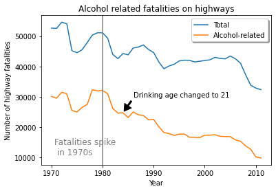

# Getting Started with Google Colaboratory

This assignment will introduce you to [Google's
Colaboratory](https://colab.google/) (Colab) software, Google's hosted [Jupyter
Notebook](https://en.wikipedia.org/wiki/Project_Jupyter) service. Colab is free
but does require a Google Account.

This is an **individual** assignment, not a team assignment. Each student is
responsible for completing this assignment and submitting their own solution.

## Colab Overview

1. If you do not have a Google account already, create one at the following
   link.
   - [https://accounts.google.com/signup/v2/webcreateaccount?hl=en&flowName=GlifWebSignIn&flowEntry=SignUp](https://accounts.google.com/signup/v2/webcreateaccount?hl=en&flowName=GlifWebSignIn&flowEntry=SignUp)

1. Become familiar with Colab's structure and capabilities by watching the
   following video:
   - [https://youtu.be/inN8seMm7UI](https://youtu.be/inN8seMm7UI) 

1. Interact with a "Getting Started" Colab notebook below:
    - [https://colab.research.google.com/notebooks/welcome.ipynb#scrollTo=5fCEDCU_qrC0](https://colab.research.google.com/notebooks/welcome.ipynb#scrollTo=5fCEDCU_qrC0)

## Create Your Own Colab Notebook

You must create a Colab notebook to perform the data analysis shown in the
graph below, and similar to the one shown in Chapter 12 of the course zyBook.



1. In the Colab *File* menu, click *New notebook*.

1. The notebook will have a default "untitled" name. Change the name to
   something meaningful.

1. Click the *+Text* button to add a text cell to the notebook.

1. Click the up-arrow button to the right to move the text cell above the
   existing code cell that was already in the notebook.

1. Double-click the text cell and enter the following:
    ```
    # Alcohol Fatalities 1970 - 2012

    This notebook will compare the trend in total highway fatalities to those
    involving alcohol from 1970 through 2012.
    ```

1. Click *+Text* and enter the following in the resulting text cell.
    ```
    Import a Python library for plotting:
    ```

1. Click *+Code* and enter the following in the resulting code cell. After
   entering the Python `import` statement, click the ">" *Run* button at the
   right of the code cell to execute this statement.
    ```python
    import matplotlib.pyplot as plt
    ```

1. Click *+Text* and enter the following in the resulting text cell.
    ```
    Data for this project is adapted from [http://www.alcoholalert.com/drunk-driving-statistics.html](http://www.alcoholalert.com/drunk-driving-statistics.html). 

    Download a CSV file with data for 1970 through 2012:
    ```

1. Click *+Code*, enter the following command, and then click the *Run* button
   to execute.
    ```
    !curl https://raw.githubusercontent.com/hendrtd/engr-1110/main/docs/data/dd_stats.csv --output dd_stats.csv
    ```

1. Continue adding code and text cells to finish creating the rest of the
    notebook at the link below.
    - [https://colab.research.google.com/drive/1mjDot4RXf4nIN7xKYfABMgQym2xtXWc-?usp=sharing](https://colab.research.google.com/drive/1mjDot4RXf4nIN7xKYfABMgQym2xtXWc-?usp=sharing)


