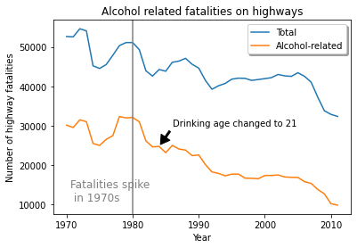

# Getting Started with Google Colaboratory

This activity will introduce you to Google's Colaboratory (Colab) software, a
cloud-based interactive computing environment similar to [Jupyter
Notebooks](https://en.wikipedia.org/wiki/Project_Jupyter). Colab is free but
does require a Google Account.

The following steps are to be completed by each student individually.

## Colab Overview

1. If you do not have a Google account already, create one at the following
   link.
   - [https://accounts.google.com/signup/v2/webcreateaccount?hl=en&flowName=GlifWebSignIn&flowEntry=SignUp](https://accounts.google.com/signup/v2/webcreateaccount?hl=en&flowName=GlifWebSignIn&flowEntry=SignUp)

1. Become familiar with Colab's structure and capabilities by watching the
   following video:
   - [https://youtu.be/inN8seMm7UI](https://youtu.be/inN8seMm7UI) 

1. Interact with a "Getting Started" Colab notebook below:
    - [https://colab.research.google.com/notebooks/welcome.ipynb#scrollTo=5fCEDCU_qrC0](https://colab.research.google.com/notebooks/welcome.ipynb#scrollTo=5fCEDCU_qrC0)

## Create Your Own Colab Notebook

Let's create a Colab notebook to produce the following plot, as shown in section
11.3 of the course zyBook.



1. In the Colab *File* menu, click *New notebook*.

1. The notebook will have a default "untitled" name. Change the name to
   something meaningful.

1. Click the *+Text* button to add a text cell to the notebook.

1. Click the up-arrow button to the right to move the text cell above the
   existing code cell that was already in the notebook.

1. Double-click the text cell and enter the following:
```
# Alcohol Fatalities 1970 - 2012

This notebook will compare the trend in total highway fatalities to those
involving alcohol from 1970 through 2012.
```


